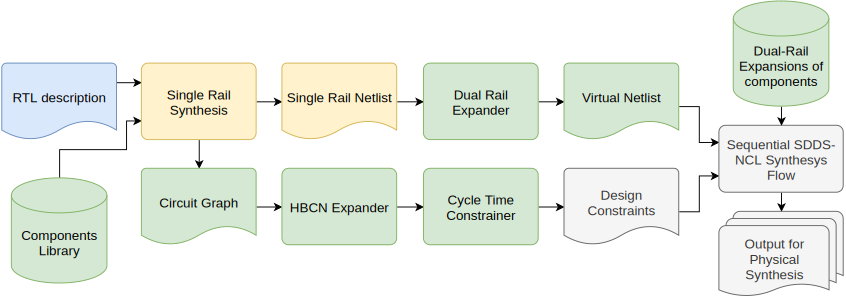
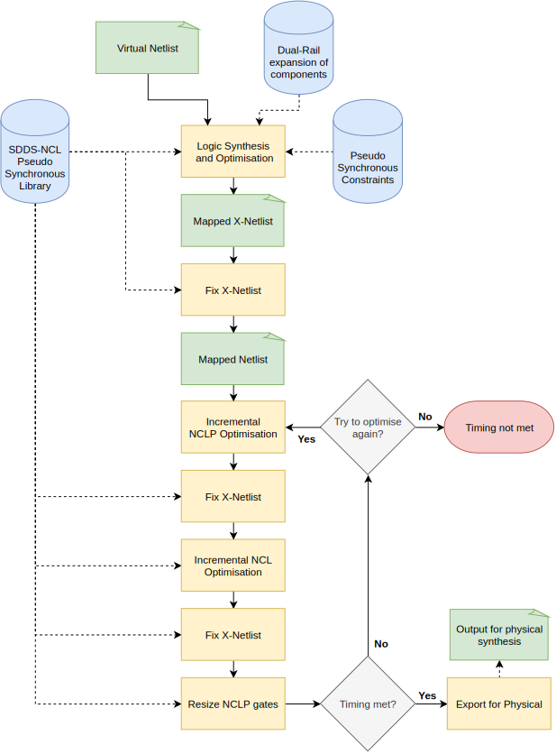

# Pulsar - A Flow to Support the Design of QDI asynchronous Circuits

This repository contains the public release of Pulsar, a timing-constrainable asynchronous circuit synthesis framework.
Pulsar is under development. 
It was part of my MSc thesis work and is now part of my ongoing PhD thesis. 
It is partially documented in references [1-3].
At the time of this writing, Pulsar is able to synthesise SDDS-NCL circuits.
The SDDS-NCL logic template that cupports the design of quasi-delay insensitive (QDI) circuits is documented in references [4-5].

Pulsar relies on Cadence Genus 18.1 or later versions to perform logic synthesis and optimisation.
This enables taking advantage of state of the art industrial synthesis tools to perform technology mapping.
The user is expected to have available a valid instalation of Genus to use Pulsar.

The Pulsar flow already supports multiple technology nodes.
Running Pulsar requires a specific cell library and some specific cell models, to generate what are called virtual netlists, a required step to adapt asynchronous design flows to employ commercial design tools.
Internaly, at the GAPH research group, libraries and models for the TSMC 180nm and STMicroelectronics 65nm bulk CMOS commercial processes already exist.
These libraries and models are respectively named ASCEnD-TSMC180 and ASCEnD-ST65.
Pulsar and the ASCEnD-TSMC180 library and models have been used on a design taped-out to Europractice's Mini@sic MPW run in May 2020.
Because these libraries are covered by NDAs with the respectives foundries, they cannot be freely distribuited.
Instead, this distribution includes a copy of ASCEnD-FreePDK45, a library and set of models developed based on the free, open source predictive FreePDK45.
More information on this library may be found at its [own repository](https://github.com/marlls1989/ascend-freepdk45).

To use this software, clone this repo and append the bin folder to your PATH:
```bash
git clone https://github.com/marlls1989/pulsar.git
cd pulsar
export PATH=$(pwd)/bin:$PATH
```
## The Pulsar Synthesis Flow

An overview of the Pulsar flow is depicted in Figure 1.
It comprises a front-end and a back-end.
The front-end is designed to be technology and template agnostic.
It produces a Virtual Netlist and a structural Circuit Graph from a high-level RTL description of the circuit in Verilog.
The front-end performs logical optimisation and maps the circuit to a abstract logic components with known dual-rail expansion.
It can also perform retiming, distributing components among pipeline stages to reduce logic complexity prior to a logic, dual-rail expansion.
The Circuit Graph captures the data flow between register components and ports, which is later used for timing analysis.
This process is better covered in references [1] and [2].

The resulting Virtual Netlist and the structural Circuit Graph are then processed by the template-dependent back-end to implement the circuit in the target technology.
Currently, the only back-end available with the Pulsar Flow targets the Pseudo-Synchronous SDDS-NCL template.
This back-end comprises the Half Buffer Channel Network (HBCN) Constrainer and the Sequential SDDS-NCL Synthesis Flow.
The HBCN Constrainer computes the HBCN model from the structural Circuit Graph and derives the design constrains to use during synthesis to constrain the cycle time.
The computation of these constraints are covered in references [2] and [3].

<figure class="image">
  <figcaption>Figure 1. Pulsar flow overview, green components are part of the flow front-end and red components are part of the flow back-end.</figcaption>
  
</figure>

The Sequential SDDS-NCL Synthesis Flow, depicted in Figure 2, is at the core of the Pulsar back-end.
It reads the Virtual Netlist and the Virtual Function Dual-Rail Expansions of components, a library of models.
This design is then flattened, optimised and mapped to NCL and NCLP gates in the target technology.
The Design Constraints built by the HBCN Constrainer steers this synthesis effort, constraining the cycle time.
The initial design mapping does not take into consideration the proper use of NCL and NCLP gates as mandated by the SDDS-NCL template. 
It can thus generate circuits with incorrect functionality.
The initial mapping is accordingly called X-Netlist and it is corrected using the Fix X-Netlist algorithm.
After correction, timing faults may have arisen, which are then fixed by iterating optimisation steps in turn on NCL and NCLP gates.
This is usually an automatic procedure.
For more information on SDDS-NCL and the Fix X-Netlist algorithm see references [4] and [5]. For the Sequential SDDS-NCL see references [2] and [3].

<figure class="image">
  <figcaption>Figure 2. Sequential SDDS-NCL Synthesis.</figcaption>
  
</figure>

## Repository Structure

This repository is organised in the following structure, each subfolder contains a README further detailing their respective contents:
- /bin : contains the precompiled drexpansion and hbcnConstrainer binaries and the scripts used to invoke genus.
- /examples : contains a tutorial demonstraining the use of pulsar to synthesise a fully function multiplier-accumulate unit.
- /haskell : references the repository containing the haskell source code for the hbcnConstrainer and drexpension tools.
- /scripts : contains the genus TCL scripts.
- /tech : contains the target technology dependent files and the virtual-netlist library of components.

## REFERENCES
[1] - SARTORI, M. L. L.; MOREIRA, M. T.; CALAZANS, N. L. V. A Frontend using Traditional EDA Tools for the Pulsar QDI Design Flow. In: 26th IEEE International Symposium on Asynchronous Circuits and Systems (ASYNC'20), 2020. To be presented.

[2] - SARTORI, M. L. L.. PULSAR: Towards a Synthesis flow for QDI Circuits. MSc Dissertation, PPGCC-FACIN-PUCRS, Porto Alegre, Brazil. August 2019. (Research Advisor: Ney Laert Vilar Calazans)

[3] - SARTORI, M. L. L.; WUERDIG, R. N.; MOREIRA, M. T.; CALAZANS, N. L. V. Pulsar: Constraining QDI Circuits Cycle Time Using Traditional EDA Tools. In: 25th IEEE International Symposium on Asynchronous Circuits and Systems (ASYNC'19), Hirosaki, 2019. pp. 114-123. (Best Paper Award Nominee)

[4] - MOREIRA, M. T.; BEEREL, P. A.; SARTORI, M. L. L.; CALAZANS, N. L. V. NCL Synthesis with Conventional EDA Tools: Technology Mapping and Optimization. IEEE Transactions on Circuits and Systems I - Regular Papers, 65(6), June 2018, pp. 1981-1993.

[5] - MOREIRA, Matheus Trevisan. Asynchronous Circuits: Innovations in Components, Cell Libraries and Design Templates. PhD Thesis, PPGCC - FACIN - PUCRS, Porto Alegre, Brazil. January 2016. 276p. Scholarship Sponsor: CNPq (PNM). (Presented and  Approved. Research Advisor: Ney Laert Vilar Calazans, Co-Advisor: Peter Beerel, University of Southern California).
